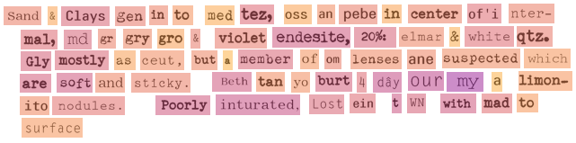

# OCR Visual Fidelity Verification

Does the OCR output, when re-rendered, visually match the original document? Traditional OCR verification methods—relying on dictionary-based checks or engine confidence scores—often struggle with technical documents that have complex layouts, specialized terminology, and degradation from age or scanning. My approach—Visual Fidelity Verification (VFV)—takes a different path by comparing the original scanned image directly with re-rendered OCR text. Rather than depending on external references or dictionaries, VFV simulates document degradation (through smudging, noise addition, etc.), then measures visual similarity using robust image comparison metrics (such as Hu moments, Jaccard similarity, Wasserstein distance, and Hausdorff distance). This technique produces detailed word-level confidence scores without requiring ground truth, making it ideally suited for challenging, multilingual, and technical documents.


## Features

- **JSON Parsing**: Parse Azure Document Intelligence JSON format maintaining original structure
- **Quality Verification**: Multiple methods to verify OCR quality without ground truth
- **Visualization**: Overlay quality indicators (using the matplotlib plasma colormap) on original document


## Examples

Here's an example of how the tool visualizes a rendered version that matches a degraded word extracted from the PDF:


And here is an example of an orginal pdf paragraph with Azure OCR quality scores (top), the a rendered version of the extracted words with simulated degradation (middle), the rendered version of the extracted text _without_ degradation (bottom). Note that the rendered words are those obtained from the Azure OCR pipeline. Deeper blues indicate low quality scores, pinks intermediate, and yellow high quality scores.




## Installation

```bash
# Clone the repository
git clone https://github.com/mengqvist/ocr_visual_fidelity_verification.git
cd ocr_visual_fidelity_verification
```

Use the `environment-dev.yml` file to create a conda environment and install the dependencies. This assumes that you have conda installed (https://docs.conda.io/en/latest/miniconda.html).

```bash
# Create a conda environment
conda env create -f environment-dev.yml

# Activate the conda environment
conda activate ocr_quality_dev
```

Then install the package with pip.

```bash
pip install -e .
```

## Usage

To process the documents and visualize your OCR verification results, first ensure that your input files are correctly placed in the **data** folder. The tool expects:

- **A PDF file:** Located in the `data/pdfs/` subfolder.
- **An OCR JSON file:** In the Azure Document Intelligence format (with flat lists for polygons, etc.), located in the `data/raw_json/` (or similar) subfolder.

Once you have your input files ready, run the viewer module using the following command:

```bash
python -m vfv.viewer --pdf data/pdfs/your_document.pdf --json data/raw_json/your_ocr.json --output images/
```

**Important Points:**

- The JSON must be in **Azure Document Intelligence** format.
- Both the PDF input and OCR JSON are required, and their paths should point to files inside the **data** folder.
- Running the command will produce three images for each page of the PDF:
  - **Original PDF Page:** The original page with overlayed Azure confidence scores.
  - **Rendered Image with OCR Text:** Shows the OCR-extracted text rendered with updated quality scores overlayed.
  - **Rendered Image with Degraded Text:** Displays a rendered version of degraded text with new quality scores overlayed.

The output images will be placed in the **images** folder. You can adjust additional parameters such as the confidence threshold and optionally generate a heatmap of OCR quality by using the appropriate command-line arguments as described in the `viewer.py` file.


## Repository Structure

The repository is structured as follows:

```
ocr-verification/
├── README.md
├── environment-dev.yml
├── setup.py
├── data/
│   ├── raw_json/
│   ├── processed_json/
│   └── pdfs/
├── fonts/
│   ├── Courier.ttf
│   ├── Elite.ttf
│   ├── Pica.ttf
│   └── ....
├── images/
│   └── example_word.png
├── vfv/
│   ├── __init__.py
│   ├── algorithms.py
│   ├── parsers.py
│   ├── viewer.py
│   └── words.py
└── tests/
    ├── test_parser.py
    └── test_words.py
```

## License

This project is licensed under the MIT License. See the [LICENSE](LICENSE) file for details.


## Future Improvements

- **Code Optimization:**  
  Enhance processing speed by refactoring and optimizing the underlying code base, ensuring faster turnaround times for large or multiple document processing.

- **Improved Similarity Metrics:**
  Improve the way the extracted word and rendered word images are compared. There are currently some instances where the two are clearly different to the human eye, but this is not captured by the similarity scores.

- **Additional Typefaces:**  
  Expand the font library to include more typefaces, catering to various document styles and historical fonts, thereby improving the fidelity of the text rendering process.

- **Font Majority Voting:**  
  Implement a font majority voting mechanism for paragraphs. This will standardize the font selection across each paragraph, promoting consistency in the re-rendered output and further improving verification accuracy.

- **Modeling Typewriter Specificities:**
  Incorporate techniques to model the lateral and vertical offset of individual characters (to account for phenomena like bent pins) specific to typewriter outputs. This will capture subtle physical imperfections and further enhance the accuracy of the OCR verification process.
